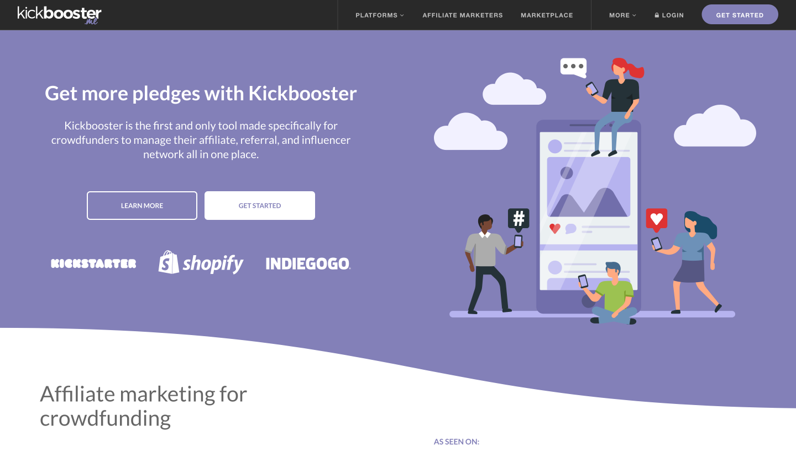
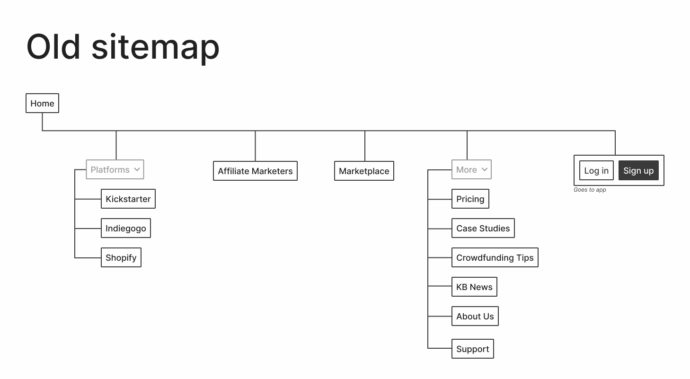
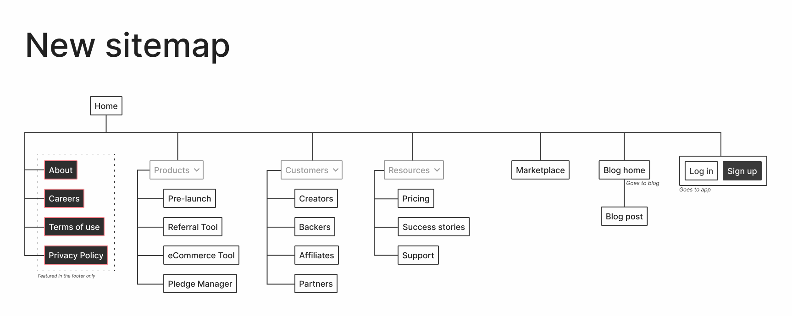
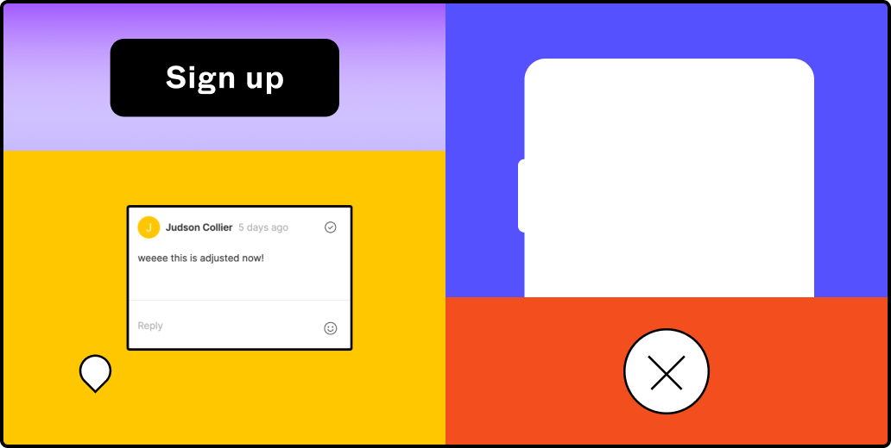
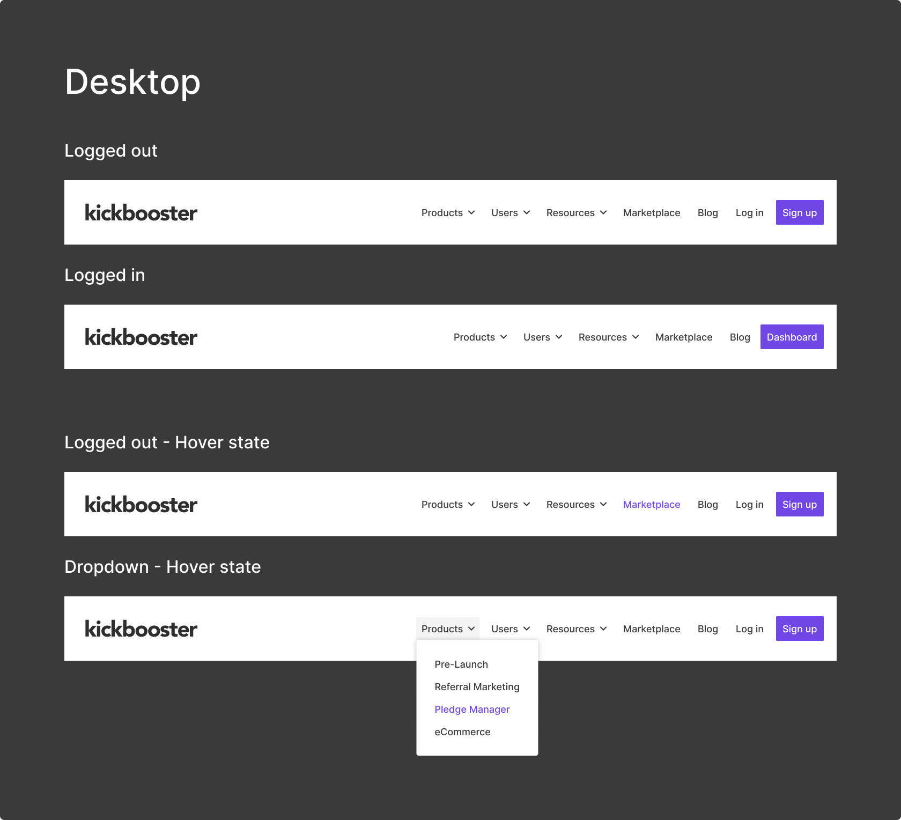
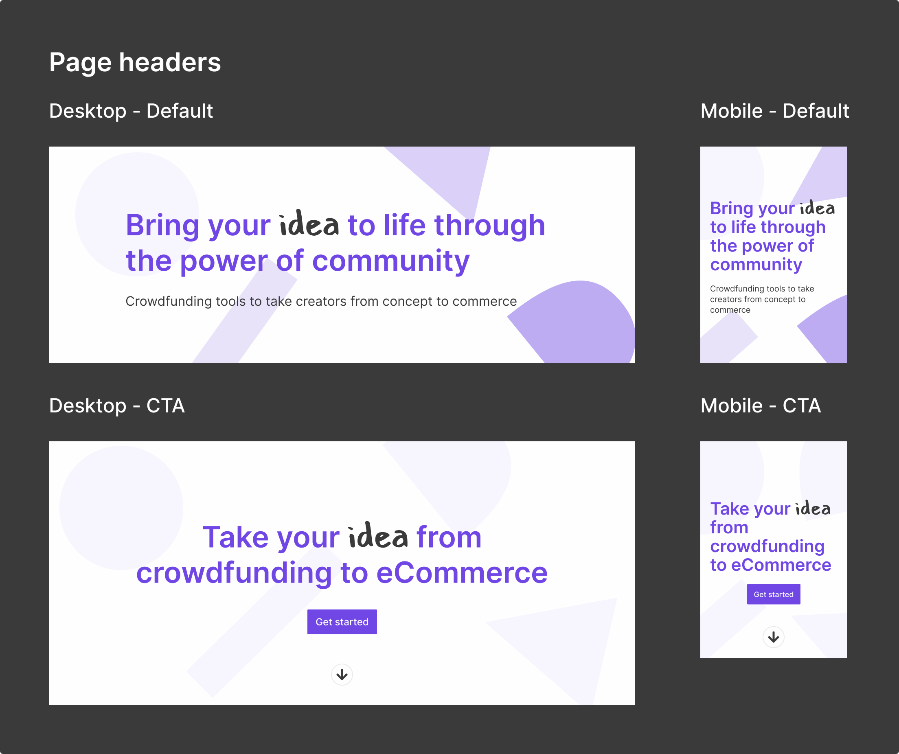
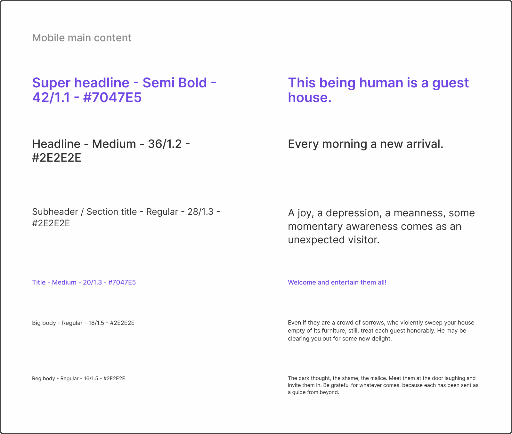
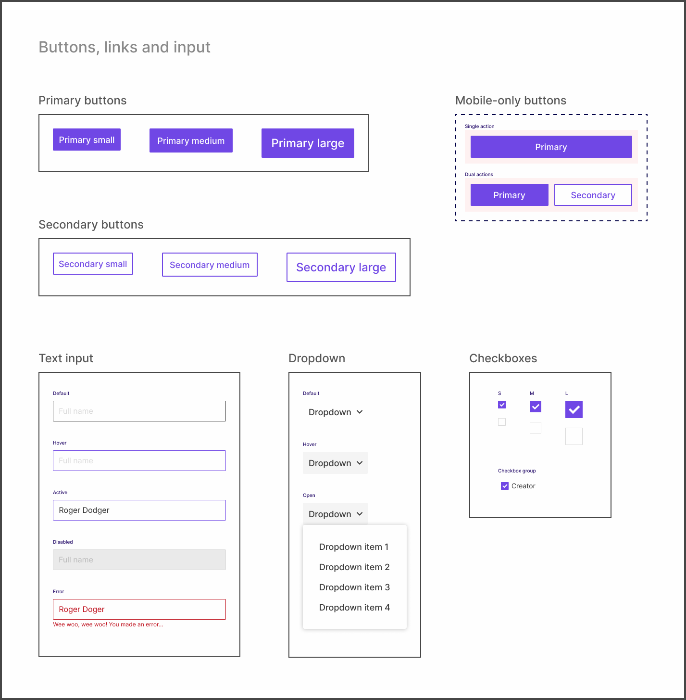
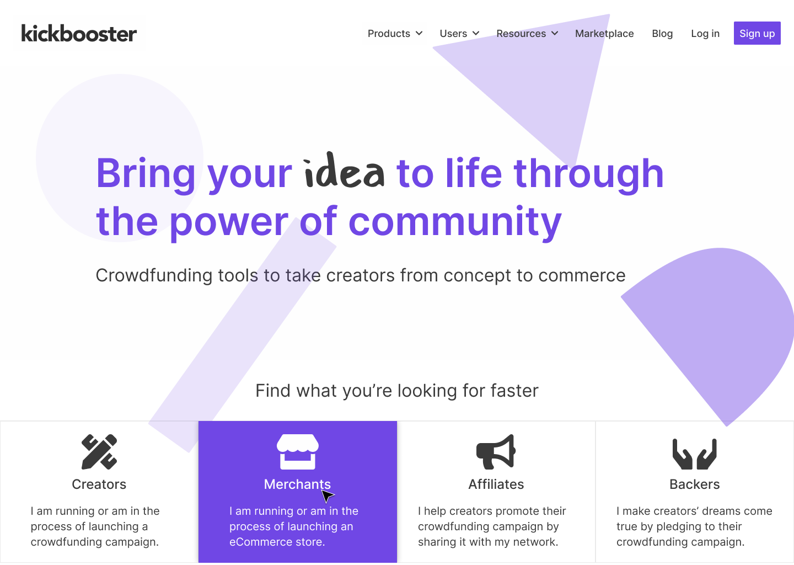

The Kickbooster brand revamp was a 6-month long project with the goal of repositioning the company as a suite of crowdfunding tools. Whereas the company was just an affiliate app previously, this rebranding aimed to expand the company’s brand as Kickbooster grew beyond just the one app. This was a cross-disciplinary project covering multiple areas such as branding, marketing design, design systems and web development.

Because of the vast scope of this project, this particular case study will only cover the web design phase. The project as a whole involved various contributors, though this phase was primarily done by me (as the sole designer on the project), with content prepared by the marketing specialist (who was also the project manager) as well as design feedback from the Kickbooster team and the design team at Bold Commerce.

The resulting products for this phase were mockups of the new website, detailing a new look and improved site navigation, and a design system for the new website; a reference for the website as well as the building blocks that make up the site.

## Overview

After the main brand elements had been created, work on the new website began. This work took about three months, spanning from April 2020 to June 2020, and involved completely overhauling the site. The major aspects that this case study will go over are: redesigning the sitemap, setting up a design system for this marketing site, and mocking up all the website’s pages.

**Timeline**  
April 2020 - June 2020 (3 months)

**My role**  
Sole designer. My duties included (but weren't limited to): remapping the website, setting up a design system for the new website, and creating all assets for the site.

**Other contributors**  
1 Marketing Specialist, who also acted as the Project Manager.

**Final products**  
A website we were proud to show people, and a design system for the new website, in Figma.

## Problem

Branding aside, the main concerns with the old website were its confusing navigation, and difficulty in adding new content. Even if it weren’t for potential customers contacting our support channel, asking for basic information about Kickbooster, the old website followed no logical order in its site navigation. As well, adding new content to the site was a lengthy endeavour since the website was built on an older framework without a content management system (CMS) and no documentation existed for it. Thus, managing content required nudging and asking the developers for their assistance.

Homepage of the old Kickbooster site.

## Process

This phase of the project went through three stages: laying out a new sitemap, setting up a design system, and creating mockups for all the pages. Most of the time was spent in the first two phases, as my efforts there would save me time when creating mockups, and later in the future when changes would need to be made.

### New sitemap needed

The biggest issue with the old site was that the navigation followed no order. Kickbooster started as just an affiliate app for crowdfunding, however, once the product grew and the company expanded, the website didn't properly keep up with the changes the company was going through. As such, new product pages were added to wherever seemed most sensible at the time (at least that's how it looked from my perspective) and the addition of a blog—which wasn't even hosted at the same URL yet placed in the navigation of the site—further added to the mess.

This part of the process was greatly sped up thanks to the Project Manager. Prior to reaching this stage of the process, they had already planned out which pages will be on the website, the content for each page and even wireframed each page. So once I reached this stage, mapping and grouping pages was a relatively simple task.

I wanted to keep the sitemap straightforward yet flexible, in case things change in the future. As well as reachable, in that pages are just a click away from the home page. On the old website, some pages were only accessible via a link from another page and didn't actually show up in the navigation bar. Lastly, unlike the old site, pages now have semantic categories; each page is now found in a sensible location.

### Setting up the design system

Setting up the design system for this new marketing website was straightforward but could have been more complex. I was still relatively new to design systems prior to this project, so the challenge for me was how to go about setting up and laying out the components in Figma. I was familiar with what should be included but I was stuck on how to best set up the system so it would be simple to use (even for non-designers) and was modular in its design (to make the developers' job easier).

#### Borrowing from the Figma team

FLEGOs cover, Figma's marketing design system.

Because I had been consuming so much content on design systems (and because I love Figma), I was aware of Figma's FLEGOs design system which their marketing team uses.  Figuring out this set up process on my own would have been ideal, but since I did not have the time and its use case fit my own, it only made sense to mimic the file and page structure of FLEGOs. Setting up the actual design system took about two weeks. It's a fairly simple marketing website, so the part that took the longest was setting up the bigger page components nicely and semantically in Figma.

Desktop navigation components.

Desktop header component samples.

Mobile typography styles.

Button and input components.

### Laying out the pages

Once the design system was laid out, mocking up each page took no time. Since the wireframes were completed prior to this stage, all that needed to be done was drag and drop the respective component in its place, change the copy and move on to the next section. This process felt oddly rewarding because the system I put in place was working and making the job simpler.

New Kickbooster homepage.

<a class="slide-animation opposite" href="https://kickbooster.me/" target="_blank"><h3 style="text-align:center">View the new Kickbooster site</h3></a>

### If I had more time...

Despite being pleased with my work in the end, I still wish I had more time on this project. More time would have given me more opportunities for exploration. Given the wireframes and content for each page made my job simpler, but its presentation wasn't explored. Because I was so crunched for time, I went the quick route by splashing some new Kickbooster paint on the wireframes and calling it a day. Similarly, I felt the home page could have been more refined as a sales pitch. Right now, it's more of a funnel and blocks of information, which is better than what it was before. However, I still have an issue with it (knowing that something I made *clearly* could be better really bothers me) and I do plan on working on changing it in my spare time at work.

## Project takeaways

Whenever I think back on this project now, the main takeaway I got was setting up a design system for the first time, but there were a few other useful things I took from this project. After consuming so much design systems content, this project gave me the opportunity to finally set up my own! It felt a little anticlimactic as I was setting it up but I had fun doing it and more importantly, there's a solid reference for the website that exists. Honestly, it felt like I cheated a bit since I just implemented what Figma has but hey, how I feel isn't too important if it got the job done efficiently.

Towards the end of the project, the developer  generously gave me a rundown of how he built the site. I have some web development skills but not quite to the level of building a brand's marketing website from the ground up in a framework I'm unfamiliar with. Though, around this time I had been learning some React (which the site is built on) so when the developer showed me how he made the site, I could understand what he and the code were saying; what does what, this piece connects to that piece, how the CMS is connected, etc. So, having that exposure and little walkthrough has made me a bit more confident in taking on some future development duties on the project. I say that blindly without having edited any code yet, but I don't doubt that I could do it.

Finally, this project provided more experience, and thus more confidence in my design process. I had been at the company for about eight months prior to this project and up until then, I rarely pushed back on decisions. I think this was due to a lack of certainty I had with the projects I was on and just a general lack of confidence in my decision making. I think the difference for this project was that there was a time or two where the product direction really didn't feel right and I acted on it. Which, I'm very glad I did as the project would have turned out different and I would still be carrying that uneasiness with me. Going forward, I think I'll feel less hesitant to act on others' opinions and decisions.

### Thank you for reading!
