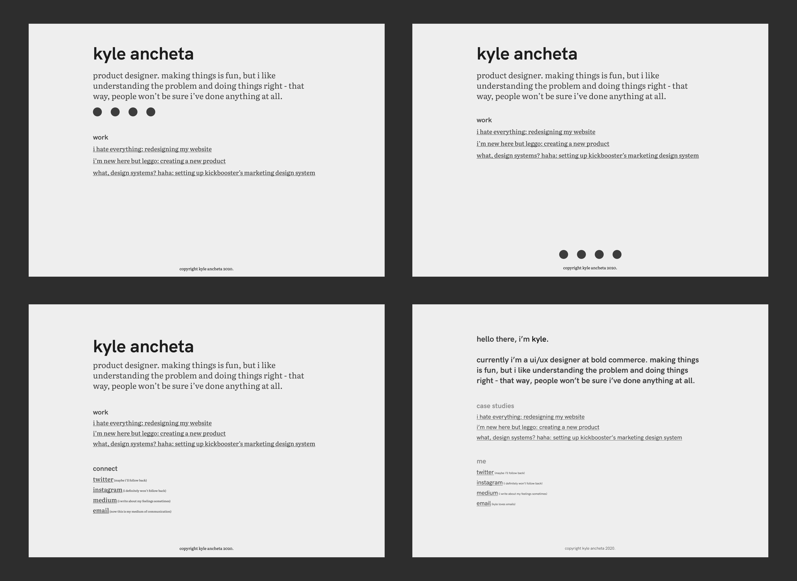
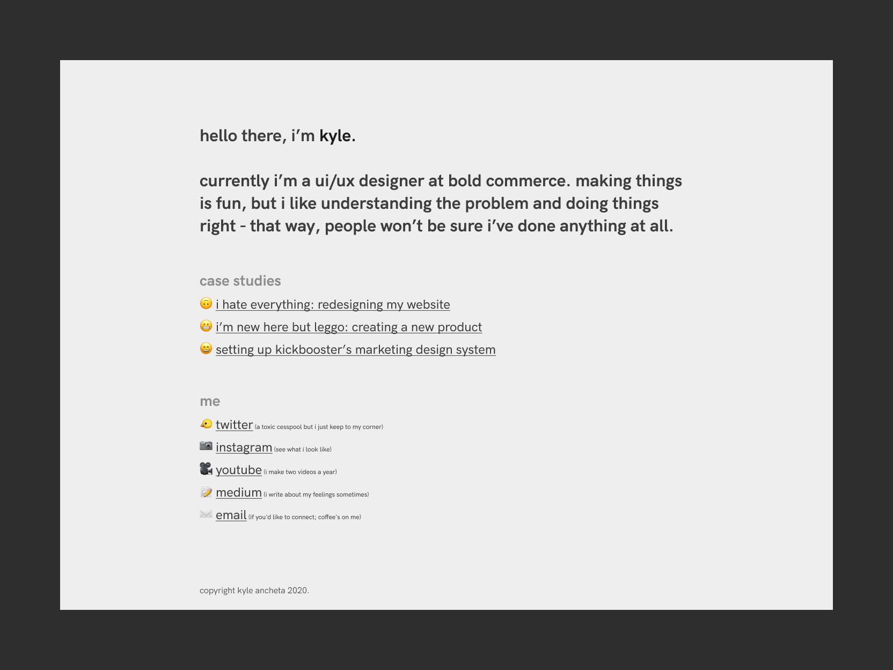

This is more of a chronological reflection of this process, rather than an in-depth case study.

It needs no introduction why any designer redesigns their portfolio. I've wanted to redesign my portfolio to how it is now because I often strive to be as minimal as I can be. So, I wanted my portfolio to reflect that. I don't think the bare minimum always equates to the most optimal, but since this is just a personal website, I saw no harm in going for just that. That said, I think the challenge in this redesign was: how do I go for the bare minimum while still showing some personality?

Personal preference aside, portfolios are always a good opportunity to practice and maintain skills. Around this time, I've been up in arms over design systems, trying to soak in as much info as I can while working on my team's design system at work. Currently, the thing I'm wrapping my head around is translating designs into code and what that process looks like. Despite learning React at this time, I simply opted to build my site in good 'ol raw HTML/CSS because I'm impatient and I wanted to get this portfolio change out the door, haha. My CSS skills were a bit rusty anyway, so this was a good time to practice.

### Straight into hi-fi

Since I had a rough idea of what I wanted my site to look like, I jumped right into hi-fi mockups. It's a personal project, and mocks are always fun so that seemed like the logical first step. My website was still going to be a homepage and case study pages, so the homepage would dictate the rest of the site. The biggest change throughout the design was the font choice. It started out with a few Google Fonts, because of how readily accessible those fonts are, however, I ultimately ended up using **HK Grotesk** because of its geometric nature. Also, because I paid for it and wanted to use it.

Home page design iterations

Final home design, which the case study pages would be based on

### Setting up the system

Once the homepage was done, I broke down the design down into its smaller parts and established the styles that would make up the case study pages. These styles would be tweaked a bit during the development phase, which I normally hate (i.e. changing the design after I've finished it) but hey, I was the CTO on this so it was a future me problem. I quite find this work fun as it's easy (though sometimes tedious) work but the end result is very pleasing. As well, in more robust systems, actually using the system is such a boost in productivity and quality of life.

<iframe style="border: 1px solid rgba(0, 0, 0, 1)" width="800" height="450" src="https://www.figma.com/embed?embed_host=share&url=https%3A%2F%2Fwww.figma.com%2Ffile%2FMuI39V7UYM5RLdDR5HzG0i%2Fhey-it-s-my-design-system.%3Fnode-id%3D6%253A10&chrome=DOCUMENTATION" allowfullscreen></iframe>

<iframe style="border: 1px solid rgba(0, 0, 0, 1)" width="800" height="450" src="https://www.figma.com/embed?embed_host=share&url=https%3A%2F%2Fwww.figma.com%2Ffile%2FMuI39V7UYM5RLdDR5HzG0i%2Fhey-it-s-my-design-system.%3Fnode-id%3D1%253A3&chrome=DOCUMENTATION" allowfullscreen></iframe>

<iframe style="border: 1px solid rgba(0, 0, 0, 1)" width="800" height="450" src="https://www.figma.com/embed?embed_host=share&url=https%3A%2F%2Fwww.figma.com%2Ffile%2FMuI39V7UYM5RLdDR5HzG0i%2Fhey-it-s-my-design-system.%3Fnode-id%3D30%253A63&chrome=DOCUMENTATION" allowfullscreen></iframe>

### CSS is fun

No sarcasm, I actually enjoy using CSS, especially for laying out websites since I get to use grid. For this kind of project, because it's so straightforward, I simply did everything in plain CSS rather than using a preprocessor, like SASS or LESS. Laying out everything in Figma beforehand really streamlined the process as I knew how the grid and text block styles should be defined. To be honest, I'm not very well-versed in CSS best practices or methodologies. The way I write CSS now has been through trial and error, slowly neatening my code and learning some tricks via The Google Machine. I have no idea if the way I write CSS is the "right" way but it's doing the job and I have no issues with the end result.

### Future additions and refactor

There's a few of things I want to add to and change about my site. The first, I think will be a relatively small addition but the latter two are projects in and of themselves:

- The first thing I want to add is dark mode, because I care about people's eyeballs. Jokes aside, I prefer dark mode UIs in general (but I won't judge you if don't) so it makes sense to implement that into my site. Like some things, I was too impatient to figure out how to properly implement it but that is a feature I'll work on later.

- The second thing I want to do is have my site meet WCAG 2.1 standards. I am aware of what a few of these standards entail, however I never looked into what the standards are exactly nor their defined criteria. Having my site meet this standard will benefit visitors to my site, and in the process, having this knowledge and practice will be a great benefit to me as a designer.

- Lastly, and eventually, I'll redevelop my site in React. I'm slowly but surely learning it on the side, and I think I have a decent grasp on how it works, so now it's just a matter of putting it into practice. I didn't start with React as I was impatient and just wanted something out the door; I needed something to showcase right away to the world because my identity as a designer is very heavily tied to my portfolio. It may not make sense to completely redo this all in React, but I enjoy both sides of the process and I would like to eventually be in a place professionally where I get to do just that.

### Thank you for reading!
